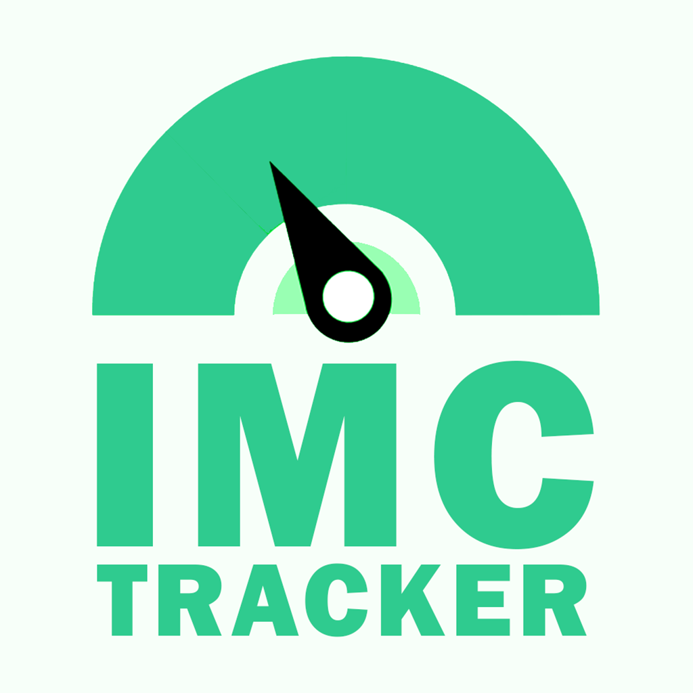

<h1 align="center">
    
    
IMCTracker

</h1>

## 📕 About

**IMCTracker** is a mobile app that I created during the React Native Course from the [**OneBitCode**](https://onebitcode.com/) learning platform. The course allowed me to have a first contact with the React Native technology, so that I could then create this mobile app that is a IMC Calculator.

## 🔨 Tools

- ReactJS
- React Native
- Expo

## 📜 License

IMCTracker is under the MIT License. See the file [LICENSE](https://github.com/MarioPonte/aluraTube/blob/main/LICENSE) for more details.
